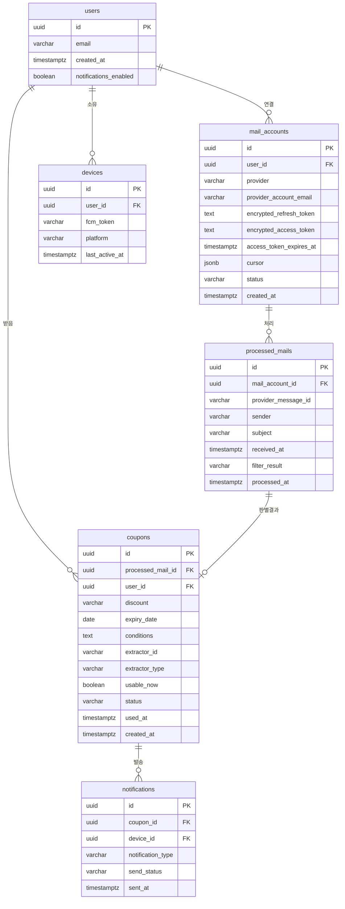

# 03. API / DB 스펙 상세 설계 ★ 심화

> **범위 변경 (2026-09-21)**: Gmail 단독 지원으로 한정됨에 따라 네이버 관련 엔드포인트/스키마를 모두 제거했다 (`00-개요.md` 참고).
>
> **스택 확정 반영 (2026-09-22)**: 스키마 적용 수단을 Prisma 마이그레이션으로 확정하고, 내부 큐 메시지 스펙을 Pub/Sub + Cloud Tasks 기준으로 다시 작성했다 (`10-기술스택결정.md`, `05-백엔드아키텍처.md`).

원본 설계의 "백엔드 기술 스택 및 인프라 구성"에서 언급만 되었던 데이터 모델과 API를 구체화한다.

## ERD 개요



## 테이블 스키마 (DDL)

> 아래 DDL이 스키마의 기준 정의다. 실제 적용은 **Prisma 마이그레이션**으로 수행한다 — `schema.prisma`를 이 DDL과 일치하도록 작성한 뒤 `prisma migrate`로 생성된 SQL을 적용하고, 마이그레이션 파일을 저장소에 커밋해 dev/prod 간 스키마를 동일하게 유지한다 (`10-기술스택결정.md`).

```sql
CREATE EXTENSION IF NOT EXISTS "pgcrypto"; -- gen_random_uuid() 사용

CREATE TABLE users (
  id UUID PRIMARY KEY DEFAULT gen_random_uuid(),
  email VARCHAR(255) UNIQUE NOT NULL,
  notifications_enabled BOOLEAN DEFAULT true,
  created_at TIMESTAMPTZ DEFAULT now(),
  updated_at TIMESTAMPTZ DEFAULT now()
);

CREATE TABLE mail_accounts (
  id UUID PRIMARY KEY DEFAULT gen_random_uuid(),
  user_id UUID NOT NULL REFERENCES users(id) ON DELETE CASCADE,
  provider VARCHAR(20) NOT NULL DEFAULT 'gmail' CHECK (provider IN ('gmail')), -- 현재는 gmail 단일 값. 향후 제공자 추가 시 CHECK만 확장
  provider_account_email VARCHAR(255) NOT NULL,
  encrypted_refresh_token TEXT,            -- AES-256-GCM, KMS 관리 키로 암호화. 연결 해제 시 NULL로 덮어써 실제 제거 (07번 문서 "토큰 폐기 흐름")
  encrypted_access_token TEXT,
  access_token_expires_at TIMESTAMPTZ,
  cursor JSONB DEFAULT '{}',               -- { historyId }
  status VARCHAR(20) DEFAULT 'active' CHECK (status IN ('active', 'reauth_required', 'auth_failed', 'revoked')),
  consecutive_failures SMALLINT DEFAULT 0,
  created_at TIMESTAMPTZ DEFAULT now(),
  updated_at TIMESTAMPTZ DEFAULT now(),
  UNIQUE(user_id, provider, provider_account_email)
);
CREATE INDEX idx_mail_accounts_status ON mail_accounts(status) WHERE status != 'active';

CREATE TABLE processed_mails (
  id UUID PRIMARY KEY DEFAULT gen_random_uuid(),
  mail_account_id UUID NOT NULL REFERENCES mail_accounts(id) ON DELETE CASCADE,
  provider_message_id VARCHAR(255) NOT NULL,
  sender VARCHAR(255) NOT NULL,
  subject VARCHAR(998),                    -- RFC 5322 제목 길이 제한
  received_at TIMESTAMPTZ NOT NULL,
  filter_result VARCHAR(20) NOT NULL CHECK (filter_result IN ('passed', 'filtered_out', 'extraction_failed')), -- MVP: LLM 미사용이므로 'llm_pending'/'llm_failed' 대신 'extraction_failed'(만료일 파싱 실패) 사용
  processed_at TIMESTAMPTZ DEFAULT now(),
  UNIQUE(mail_account_id, provider_message_id)  -- 중복 처리 방지 핵심 제약
);
CREATE INDEX idx_processed_mails_account_date ON processed_mails(mail_account_id, received_at DESC);

CREATE TABLE coupons (
  id UUID PRIMARY KEY DEFAULT gen_random_uuid(),
  processed_mail_id UUID NOT NULL REFERENCES processed_mails(id) ON DELETE CASCADE,
  user_id UUID NOT NULL REFERENCES users(id) ON DELETE CASCADE,
  discount VARCHAR(100),
  expiry_date DATE,
  conditions TEXT,
  extractor_id VARCHAR(50) NOT NULL,       -- 예: 'coupang_v1', 'generic_v1' (어떤 파서가 추출했는지, 신뢰도의 대리 지표)
  extractor_type VARCHAR(20) NOT NULL CHECK (extractor_type IN ('sender_specific', 'generic_regex', 'llm')), -- 'llm'은 향후 확장용, MVP에서는 미사용
  usable_now BOOLEAN NOT NULL,
  status VARCHAR(20) DEFAULT 'active' CHECK (status IN ('active', 'expired', 'used', 'dismissed')),
  used_at TIMESTAMPTZ,                     -- 사용 완료 표시 시각. MVP는 컬럼만 선반영하고 UI/API는 3단계 베타에서 활성화 (00번 문서 결정 #3)
  created_at TIMESTAMPTZ DEFAULT now()
);
CREATE INDEX idx_coupons_user_status ON coupons(user_id, status, expiry_date);

CREATE TABLE devices (
  id UUID PRIMARY KEY DEFAULT gen_random_uuid(),
  user_id UUID NOT NULL REFERENCES users(id) ON DELETE CASCADE,
  fcm_token VARCHAR(500) NOT NULL,
  platform VARCHAR(10) NOT NULL CHECK (platform IN ('ios', 'android')),
  last_active_at TIMESTAMPTZ DEFAULT now(),
  created_at TIMESTAMPTZ DEFAULT now(),
  UNIQUE(user_id, fcm_token)
);

CREATE TABLE notifications (
  id UUID PRIMARY KEY DEFAULT gen_random_uuid(),
  coupon_id UUID REFERENCES coupons(id) ON DELETE CASCADE,
  device_id UUID REFERENCES devices(id) ON DELETE SET NULL,
  notification_type VARCHAR(20) DEFAULT 'new_coupon' CHECK (notification_type IN ('new_coupon', 'expiry_reminder')),
  send_status VARCHAR(20) DEFAULT 'pending' CHECK (send_status IN ('pending', 'sent', 'failed', 'skipped_disabled')),
  retry_count SMALLINT DEFAULT 0,
  sent_at TIMESTAMPTZ,
  created_at TIMESTAMPTZ DEFAULT now()
);
CREATE INDEX idx_notifications_status ON notifications(send_status) WHERE send_status = 'pending';
```

> 규칙 필터 관리 테이블(`filter_domains`, `filter_keywords`)은 02번 문서에 정의되어 있다. LLM 호출 결과를 재사용하던 `coupon_pattern_cache`는 MVP에서 LLM을 쓰지 않으므로 제거했다.

### 설계 노트
- `processed_mails.subject`, `sender`만 저장하고 본문은 저장하지 않는다 — 원본 설계의 "메일 원문 미저장" 원칙을 스키마 레벨에서 강제.
- 다중 디바이스 발송은 **사용자의 모든 활성 디바이스에 발송**하는 정책으로 확정했다 (00번 문서 결정 #2). `NotificationService`는 `devices`에서 해당 사용자의 활성 레코드를 전부 조회해 각각 `notifications` 레코드를 만든다. 무효 토큰과 90일 미접속 디바이스는 `04-푸시알림.md`의 수명주기 정책으로 정리되므로 별도 상한은 두지 않는다.
- `coupons.status`의 `used`/`dismissed`와 `used_at` 컬럼은 쿠폰 사용 추적용으로 스키마에만 선반영한 것이다 (00번 문서 결정 #3). MVP(1~2단계)에서는 쓰지 않고 3단계 베타에서 `PATCH /coupons/:id`와 함께 활성화한다 — 나중에 컬럼을 추가하는 마이그레이션을 피하려는 목적.

## REST API 명세

### 인증 관련
| 메서드 | 경로 | 설명 | 요청 | 응답 |
| --- | --- | --- | --- | --- |
| GET | `/auth/gmail/url` | Gmail OAuth 인증 URL 발급 | - | `{ url: string, state: string }` |
| POST | `/auth/gmail/callback` | Gmail 인증 코드 교환 겸 **로그인** | `{ code, state }` | `{ mailAccountId, email, accessToken }` |
| DELETE | `/mail-accounts/:id` | 계정 연결 해제 (토큰 폐기 + revoke) | - | `204` |

### 사용자/디바이스
| 메서드 | 경로 | 설명 | 요청 | 응답 |
| --- | --- | --- | --- | --- |
| POST | `/devices` | 디바이스 푸시 토큰 등록 | `{ fcmToken, platform }` | `{ deviceId }` |
| DELETE | `/devices/:id` | 디바이스 등록 해제 (로그아웃 시) | - | `204` |
| PATCH | `/users/me/notification-settings` | 알림 on/off | `{ notificationsEnabled: boolean }` | `200` |

### 쿠폰
| 메서드 | 경로 | 설명 | 요청 | 응답 |
| --- | --- | --- | --- | --- |
| GET | `/coupons?status=active&sort=expiry_asc` | 쿠폰 목록 조회 | 쿼리 파라미터 | `{ coupons: Coupon[] }` |
| GET | `/coupons/:id` | 쿠폰 상세 조회 | - | `Coupon` |
| PATCH | `/coupons/:id` | 쿠폰 상태 변경 (사용함/숨김 표시) — **3단계 베타에서 활성화** | `{ status: 'used' \| 'dismissed' }` | `200` |
| POST | `/coupons/:id/feedback` | 오탐지 신고 — **3단계 베타 필수** (정확도 측정의 유일한 실측 수단, 02번 문서 참고) | `{ isAccurate: boolean }` | `204` |

### 공통 사항
- 모든 엔드포인트는 `Authorization: Bearer <session_jwt>` 필요 (앱 자체 로그인 세션, 메일 OAuth 토큰과는 별개)
  - **예외 (2026-09-23 보완)**: `/auth/gmail/url`과 `/auth/gmail/callback`은 세션을 받기 전에 호출되므로 세션이 필요 없다. 원래 이 문서에는 로그인 엔드포인트가 없어 "세션 JWT를 어디서 받는가"가 비어 있었는데, 온보딩이 "Gmail로 시작하기" 단일 진입점이므로(`06-모바일앱구조.md`) **OAuth 콜백이 곧 회원가입 겸 로그인**이다. 그래서 콜백 응답에 `accessToken`(세션 JWT)을 추가했다
  - CSRF는 `/auth/gmail/url`이 발급한 `state`(서명된 단기 토큰)를 콜백에서 검증해 막는다. 서버에 상태를 저장하지 않는다
- 에러 응답 포맷 통일: `{ error: { code: string, message: string } }` — 프런트에서 `code`로 분기 처리 (예: `GMAIL_TOKEN_REVOKED`, `GMAIL_AUTH_FAILED`)
- Rate limit: 사용자당 분당 60 요청 (API Gateway 레벨)

## 내부 메시지 스펙

큐가 Pub/Sub + Cloud Tasks로 바뀌었으므로(`05-백엔드아키텍처.md`), 페이로드는 **HTTP 요청 본문**으로 전달된다. 타입은 그대로 인터페이스로 고정해 서비스 간 계약을 명확히 한다.

```ts
// Pub/Sub 토픽: mail-ingest
// ordering key = mailAccountId (동일 계정 메시지의 순서 보장)
interface MailIngestMessage {
  mailAccountId: string;
  triggeredBy: 'webhook' | 'polling';
  historyId?: string;          // webhook 경유 시에만 존재
}

// Pub/Sub 토픽: coupon-classify
interface CouponClassifyMessage {
  processedMailId: string;
}

// Cloud Tasks 큐: push-dispatch
interface PushDispatchTask {
  couponId: string;
  notificationType: 'new_coupon' | 'expiry_reminder';
}

// Cloud Tasks 큐: coupon-expiry-reminder
// 쿠폰 생성 시점에 schedule_time을 만료 임박 시각으로 지정해 미리 예약한다
interface ExpiryReminderTask {
  couponId: string;
}
```

### 전달 규약

- **Pub/Sub 메시지**는 base64로 인코딩되어 `message.data`에 담겨 push 구독으로 전달된다. 핸들러는 디코딩 후 위 인터페이스로 파싱한다.
- **처리 성공은 2xx 응답으로 표현한다.** 4xx/5xx를 반환하면 재전달된다.
- 두 서비스 모두 **at-least-once**이므로 모든 핸들러는 멱등해야 한다. 중복 방어 수단은 `processed_mails` 유니크 제약과 `notifications` 발송 이력이다 (`08-에러처리및엣지케이스.md`).
- 재시도를 소진한 Pub/Sub 메시지는 dead letter topic으로 이동한다.
