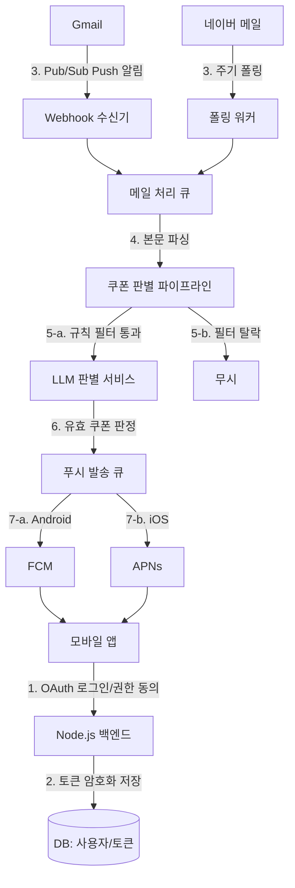
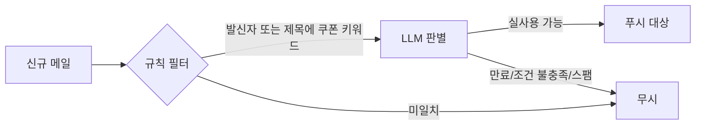
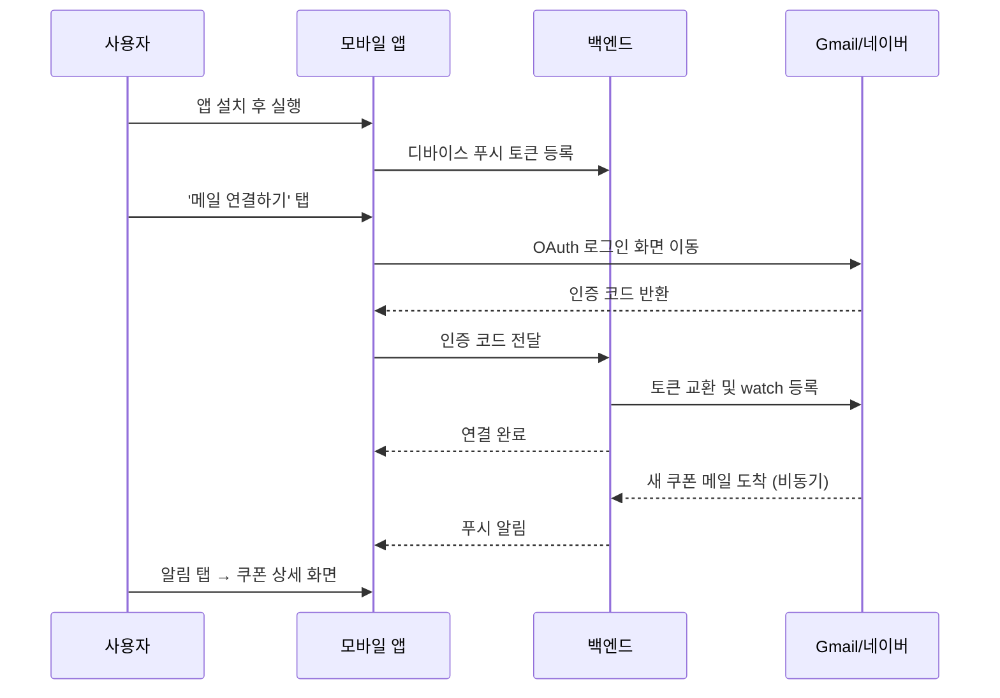

# 메일 쿠폰 알림 앱 - 기술 아키텍처 설계

2026-09-21 · @작성자

## 개요 및 목표

사용자의 메일함(Gmail, 네이버 메일)에 도착하는 쿠폰/프로모션 메일을 실시간으로 감지하고, 실제로 사용 가능한 쿠폰인지 판별해 모바일 푸시 알림으로 전달하는 네이티브 앱을 만든다.

**핵심 사용자 시나리오**
1. 사용자가 앱을 설치하고 Gmail 또는 네이버 메일 계정으로 로그인해 메일 읽기 권한을 위임한다.
2. 쇼핑몰, 배달앱, 항공사 등에서 쿠폰/할인 메일이 도착하면 서버가 이를 감지한다.
3. 서버가 메일 본문을 분석해 '실제로 사용 가능한 쿠폰'(만료되지 않았고, 조건이 충족되는 쿠폰)인지 판별한다.
4. 유효한 쿠폰으로 판별되면 앱으로 푸시 알림을 보낸다 (예: "쿠팡에서 15% 할인 쿠폰이 도착했어요, 9/30까지 사용 가능").

**성공 기준**
- 신규 메일 도착 후 수 분 이내 알림 전달 (실시간성)
- 스팸/이미 만료된/조건 불충족 쿠폰은 걸러내어 알림 피로도를 낮춤 (정밀도)
- Gmail, 네이버 메일 두 제공자를 모두 지원
- 메일 원문은 서버에 영구 저장하지 않음 (개인정보 최소 수집 원칙)

## 전체 시스템 아키텍처

네 개 컴포넌트가 연동된다: 모바일 앱(iOS/Android), Node.js 백엔드, 메일 제공자(Gmail/네이버), 푸시 서비스(FCM/APNs).



**핵심 흐름 요약**
1. 앱에서 OAuth로 메일 읽기 권한을 받고, 백엔드가 토큰을 암호화해 저장한다.
2. Gmail은 실시간 push(Pub/Sub), 네이버는 주기 폴링으로 신규 메일을 감지한다.
3. 큐에 쌓인 메일을 워커가 파싱해 쿠폰 판별 파이프라인으로 보낸다.
4. 규칙 필터를 통과한 건만 LLM이 '실사용 가능' 여부를 판정한다(비용 절감).
5. 유효한 쿠폰만 푸시 발송 큐에 들어가고, 운영체제에 따라 FCM 또는 APNs로 발송된다.

## 메일 접근 방식 설계

Gmail과 네이버 메일은 연동 성숙도가 크게 다르다. Gmail은 공식 REST API와 실시간 push를 지원하지만, 네이버는 개인 개발자용 공식 메일 API가 없어 IMAP 또는 네이버 클라우드(네이버웍스 메일) 연동 원칙을 검토해야 한다.

| 구분 | Gmail | 네이버 메일 |
| --- | --- | --- |
| 연동 방법 | Gmail API (REST, OAuth 2.0) | IMAP (네이버 메일 설정에서 IMAP/SMTP 허용 필요) |
| 실시간 감지 | Cloud Pub/Sub 기반 push 지원 (`users.watch`) | 지원 안됨 → IMAP IDLE 또는 주기 폴링으로 대체 |
| 인증 방식 | OAuth 2.0 (Google 심사 필요) | 앱 비밀번호(App Password) 발급 방식, 또는 네이버웍스 메일 계정 연동 (법인/업무용에 한정) |
| 개발자 심사 | Google API 심사 (민감 scope로 분류되어 보안 심사 필요, 수 주~수 개월) | 단일 발급처 심사 없음, 대신 사용자가 직접 IMAP 설정을 켜야 함 |
| 안정성 | 높음 (공식 API SLA) | 중간 (IMAP 접속 제한, 계정 잠금 위험) |

**설계 결론**
- Gmail: `gmail.readonly` scope로 OAuth 연동 후 Gmail API로 직접 메일 메타데이터와 본문을 읽는다.
- 네이버: 공식 OAuth가 없으므로, 앱 내에서 사용자에게 '네이버 메일 설정 > POP3/IMAP 설정'에서 IMAP을 직접 켜고 앱 비밀번호를 발급받도록 안내하는 온보딩 플로우가 필요하다. 이 과정이 사용자 경험상 마찰이지만, 현재 네이버가 제3자 앱용 공식 OAuth 메일 API를 제공하지 않기 때문에 유일한 현실적 대안이다.
- 두 경로 모두 백엔드에서 단일 `MailProvider` 인터페이스로 추상화해 후속 쿠폰 판별 로직은 제공자와 무관하게 동일하게 동작하도록 한다.

## 신규 메일 실시간 감지

**Gmail: Pub/Sub Push 구독**
1. Google Cloud Pub/Sub 토픽을 만들고 구독자(백엔드 webhook)를 연결한다.
2. 사용자당 `users.watch()` API를 호출해 해당 계정의 변경 사항을 구독한다 (구독은 7일마다 만료되므로 갱신 배치 필요).
3. 새 메일 도착 시 Pub/Sub가 webhook을 호출하면, 백엔드가 `historyId`로 변경분만 `history.list()`로 조회해 신규 메일 ID를 얻는다.
4. 지연시간은 보통 수 초~수십 초 수준.

**네이버: IMAP 폴링 또는 IDLE**
1. IMAP은 `IDLE` 명령으로 서버가 새 메일을 푸시해줄 때까지 연결을 유지하는 방식을 지원하지만, 모바일/클라우드 환경에서 연결을 계속 유지하는 방식은 비효율적이다.
2. 실용적으로는 **1~5분 간격 폴링**이 현실적이다: 워커가 사용자별 IMAP에 접속해 `UIDNEXT` 값을 비교해 신규 메일을 판별한다.
3. 대규모 사용자일 경우 IMAP 동시 접속 수와 계정 잠금 위험을 고려해 사용자별 폴링 주기를 분산(jitter)시키고 백오프 재시도를 적용한다.

**비교**

| 항목 | Gmail Push | 네이버 폴링 |
| --- | --- | --- |
| 지연시간 | 수 초 | 1~5분 (폴링 주기에 종속) |
| 서버 부하 | 낮음 (이벤트 기반) | 높음 (사용자 수에 비례해 증가) |
| 구현 복잡도 | 중간 (Pub/Sub 구독 갱신 필요) | 낮음이지만 워커 스케일링 설계 필요 |

이로 인해 초기 MVP는 **두 제공자 모두 폴링 방식**으로 통일하고(구현 단순화), 사용자 규모가 커지면 Gmail만 Push로 전환하는 단계적 접근을 권장한다.

## 쿠폰 판별 로직 설계

모든 신규 메일을 LLM에 보내면 비용과 지연이 커지므로, 규칙 필터 이후 LLM 판별을 거치는 2단계 파이프라인을 쓴다.



**1단계: 규칙 기반 필터 (저비용)**
- 발신자 도메인 화이트리스트 (자주 쓰는 쇼핑몰/브랜드 도메인은 사용자가 직접 등록)
- 제목에 포함된 키워드: '쿠폰', '할인코드', '쿠팡', '%할인', 'coupon', 'promo code' 등
- 이 단계를 통과하지 못하면 즉시 폐기하여, 전체 메일의 대부분이 여기서 걸러지도록 한다

**2단계: LLM 기반 실사용 가능 판별**

통과된 메일 본문을 LLM에 전달해 구조화된 출력을 요구한다:

```json
{
  "is_coupon": true,
  "discount": "15%",
  "expiry_date": "2026-09-30",
  "conditions": "3만원 이상 구매 시",
  "usable_now": true,
  "confidence": 0.92
}
```

판단 기준은 세 가지다: (1) 만료일이 지나지 않았고, (2) 조건을 충족할 수 있으며, (3) 스팸성 문구가 아니면 `usable_now: true`로 판정한다. confidence가 0.7 미만이면 보수적으로 푸시를 보내지 않는다.

**비용 및 정확도 관리**
- 규칙 필터에서 전체 메일의 90% 이상을 거르는 것을 목표로 하여 LLM 호출량을 최소화한다
- 동일 발신자의 반복되는 제목 패턴을 캐싱해 중복 호출을 방지한다 (예: 동일 형식의 주간 프로모션 메일)
- 만료일 재확인이 필요한 쿠폰은 만료 직전에 리마인더 푸시를 별도로 발송하는 기능을 캐싱에 포함한다

## 푸시 알림 발송 설계

앱이 최초 실행될 때 디바이스 푸시 토큰(FCM/APNs)을 발급받아 백엔드 DB에 등록하고, 쿠폰이 판정되면 해당 토큰으로 발송한다.

**구조**
- Android → Firebase Cloud Messaging(FCM)
- iOS → Apple Push Notification service(APNs), 또는 FCM이 내부적으로 APNs를 중계하도록 통합 (React Native를 쓸 경우 `@react-native-firebase/messaging`으로 둘 다 처리 가능)

**디바이스 토큰 관리**
- 앱 설치/로그인 시 `POST /devices` → `{userId, fcmToken, platform}` 저장
- 토큰이 만료/갱신되면 클라이언트가 자동 갱신 이벤트를 발생시키고, 백엔드는 이를 반영해 구토큰을 무효화
- 발송 실패 응답(`UNREGISTERED`, `NotRegistered`) 수신 시 해당 토큰을 DB에서 삭제

**알림 페이로드 설계**
```json
{
  "notification": {
    "title": "새 쿠폰 도착",
    "body": "쿠팡 15% 할인 쿠폰 · 9/30까지 사용가능"
  },
  "data": {
    "couponId": "c_8823",
    "emailId": "gmail_18a...",
    "expiryDate": "2026-09-30",
    "deeplink": "myapp://coupons/c_8823"
  }
}
```
- `data` 페이로드로 앱 내 쿠폰 상세 화면으로 딥링크 이동
- 만료일이 가까운 쿠폰은 제목에 D-day를 함께 표기해 긴급도를 전달

**발송 및 재시도 정책**
- 푸시 발송 실패 시 지수 백오프로 3회까지 재시도
- 사용자가 알림을 끌 수 있도록 앱 설정 페이지에 토글 제공, 꺼져있으면 백엔드가 발송 자체를 생략

## 백엔드 기술 스택(Node.js) 및 인프라 구성

| 계층 | 기술 | 이유 |
| --- | --- | --- |
| API 서버 | Node.js + NestJS (또는 Express) | 모듈 구조가 명확해 OAuth/사용자/쿠폰 도메인 분리에 적합 |
| 메일 수집 워커 | Node.js worker (BullMQ) | Gmail webhook 수신 및 네이버 IMAP 폴링을 비동기 큐로 처리 |
| 큐/메시징 | Redis + BullMQ | 메일 처리, LLM 판별, 푸시 발송을 각각 별도 큐로 분리해 장애 격리 |
| 데이터베이스 | PostgreSQL | 사용자, OAuth 토큰(암호화), 쿠폰 기록, 디바이스 토큰 |
| 비밀 관리 | AWS Secrets Manager / GCP Secret Manager | Gmail/네이버 OAuth 클라이언트 비밀, 암호화 키 관리 |
| 배포 | Docker + Kubernetes 또는 AWS ECS | 워커와 API를 독립적으로 스케일링 |
| 모니터링 | Sentry(에러) + Datadog/Grafana(메트릭) | 메일 처리 지연/실패율, LLM 호출량 추적 |

**핵심 서비스 모듈**
1. `AuthService` – Gmail/네이버 OAuth 플로우, 토큰 생명주기 관리
2. `MailIngestService` – Gmail webhook 수신, 네이버 IMAP 폴러, 중복 제거
3. `CouponClassifierService` – 규칙 필터 + LLM 호출 오케스트레이션
4. `NotificationService` – FCM/APNs 발송, 재시도, 토큰 수명주기 관리
5. `UserService` – 계정 설정, 알림 설정, 연결된 메일 계정 관리

## 모바일 앱 구조 설계

**추천 기술**: React Native (iOS/Android 동시 지원, 별도 Swift/Kotlin 이중 개발 불필요)



**화면 구성**
1. **온보딩**: 앱 소개 → 메일 서비스 선택(Gmail/네이버) → 권한 안내 화면(읽기 전용, 보관 안함 명시) → OAuth 로그인
2. **쿠폰 목록**: 사용 가능한 쿠폰을 카드 형태로 나열 (만료일순 정렬, D-day 배지)
3. **쿠폰 상세**: 할인율/코드/조건/만료일, 원본 메일 링크
4. **설정**: 연결된 계정 관리, 알림 on/off, 계정 연결 해제(권한 회수)

**백그라운드 푸시 수신**
- iOS: `UNUserNotificationCenter` 권한 요청, 백그라운드 모드에서는 OS가 알림을 직접 표시(앱 코드 실행 안 됨)
- Android: FCM이 포그라운드에서도 수신 가능하도록 기본 지원
- 알림 탭 시 `deeplink` 데이터를 읽어 해당 쿠폰 상세 화면으로 직접 이동

## 보안 및 개인정보보호 고려사항

이 앱은 사용자의 메일 전체에 접근하므로 가장 민감한 계층이다. 다음 원칙을 설계에 반영해야 한다.

**접근 범위 최소화**
- Gmail은 반드시 `gmail.readonly` 또는 가능하다면 더 좁은 `gmail.metadata` scope를 검토 (제목/발신자만 필요한 경우). 본문까지 필요하면 `gmail.readonly`까지만 요청하고 삭제/발송 권한은 절대 요청하지 않는다.
- 네이버 IMAP은 읽기 전용 계정(쓰기 권한 미사용)으로만 연결

**데이터 보관 정책**
- 메일 원문은 판별 직후 폐기하고 DB에 저장하지 않는다. 저장하는 것은 쿠폰 메타데이터뿐(할인율, 만료일, 발신자, 원본 메일 ID만)
- OAuth Refresh Token은 AES-256으로 암호화해 저장하고, 키는 KMS/Secrets Manager에서 관리
- 사용자가 계정 연결을 해제하면 토큰을 즉시 폐기하고 Google/네이버 측에도 access revoke 호출

**개인정보처리방침 요구사항**
- 수집항목, 이용목적, 보유기간을 명시한 개인정보처리방침 필수 (Google API 사용자 데이터 정책상 필수 제출 문서)
- Google의 Limited Use 정책(https://developers.google.com/terms/api-services-user-data-policy)을 준수: 메일 내용을 광고/프로파일링 목적으로 사용 불가, 명시된 기능(쿠폰 알림)에만 사용
- 민감 scope 사용 시 CASA(Cloud Application Security Assessment) 보안 심사 대상이 될 수 있음 (다음 섹션에서 자세히 다룸)

## 앱스토어/플레이스토어 배포를 위한 사전 준비사항

Gmail 민감 scope를 사용하는 앱은 개발만큼이나 심사가 오래 걸릴 수 있으므로 이 절차를 초기부터 일정에 반영해야 한다.

**Google OAuth 심사**
1. Google Cloud Console에서 프로젝트 생성 후 OAuth 동의화면 구성 (앱 이름, 로고, 개인정보처리방침 URL 필수)
2. `gmail.readonly` 등 민감 scope 요청 시 **보안 사용자 확인(Security Assessment)** 대상이 될 수 있으며, 이는 제3자 보안감사법인을 통해 진행되고 비용과 수 주의 시간이 소요될 수 있음
3. 심사 전까지는 테스트 사용자(본인 계정 100명까지)만 사용 가능한 '미검증(unverified) 상태'로 운영 가능
4. 품질이 중요하다: 데모 영상, 보안 백서(암호화 방식, 데이터 보관 정책), 개인정보처리방침 문서를 사전에 준비

**필요 문서 체크리스트**
- [ ] 개인정보처리방침 (수집항목/목적/보유기간 명시)
- [ ] 서비스 이용약관
- [ ] 데이터 보안 백서 (토큰 암호화, 접근 통제 방식 설명)
- [ ] 앱의 실제 동작을 보여주는 데모 영상 (Google 심사 제출용)
- [ ] Apple App Store의 App Privacy 설문지 작성 (수집 데이터 유형 명시)
- [ ] 네이버 이용자 안내문구 (App 비밀번호 발급 방법 설명, 온보딩 튜토리얼)

**권장**: 심사 기간 동안에는 테스트 계정만으로 먼저 출시(soft launch)하고, 심사 통과 후 일반 공개로 전환하는 단계적 출시 전략을 권장

## 개발 로드맵 및 마일스톤

| 단계 | 기간 | 목표 |
| --- | --- | --- |
| 1. MVP 백엔드 | 2–3주 | Gmail OAuth 연동, 폴링 기반 신규 메일 감지, 규칙 필터 + LLM 판별 파이프라인 |
| 2. 모바일 앱 프로토타입 | 2–3주 | React Native 기본 화면(온보딩, 쿠폰 목록), FCM 연동, Gmail만으로 내부 테스트 |
| 3. 네이버 메일 연동 추가 | 1–2주 | IMAP 연동, 앱 비밀번호 온보딩 플로우 UI |
| 4. 내부 베타 (Closed Test) | 2–4주 | 대상: 본인 및 지인 계정 100명이내, 쿠폰 판별 정확도/오탐지율 측정 및 규칙 보정 |
| 5. Google OAuth 보안 심사 제출 | 심사 4–8주 (대기) | 보안 백서, 데모 영상, 개인정보처리방침 등 제출 |
| 6. 심사 대기 중 마무리 작업 | 심사와 병행 | 앱스토어/플레이스토어 심사 제출 준비, 서버 스케일링/모니터링 구축 |
| 7. 정식 출시 | 심사 통과 후 | 일반 공개, 점진적 롤아웃(10% → 50% → 100%) |

**주요 리스크**
- Google OAuth 심사 기간이 예측보다 길어질 수 있음 → 전체 일정의 병목 구간이므로 가장 먼저 시작하는 것을 권장
- 네이버 IMAP은 공식 파트너십이 아니므로 정책 변경 시 연동이 끊길 수 있음 → IMAP 설정 안내를 최신 상태로 유지해야 함
